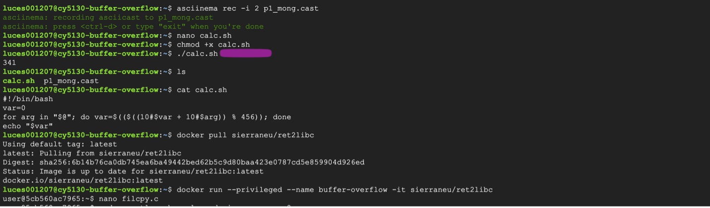
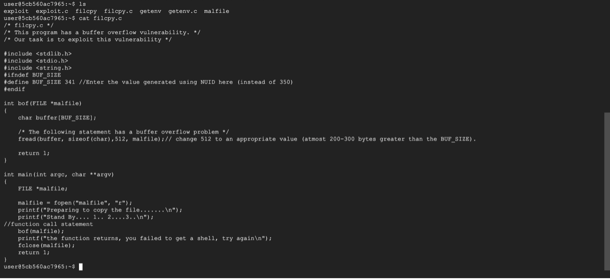
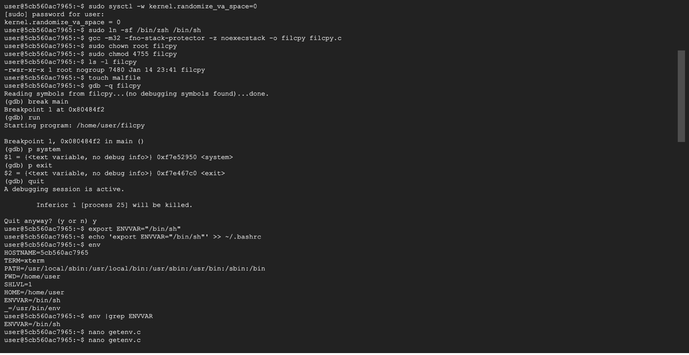
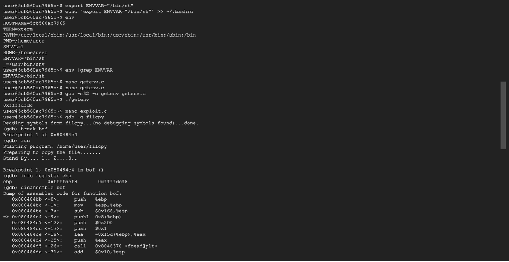
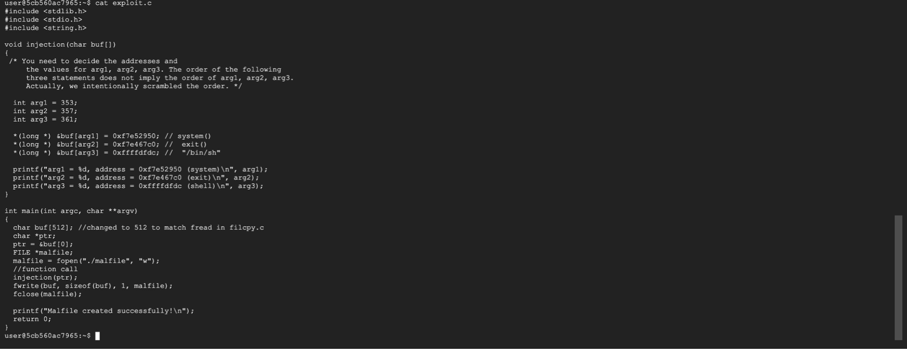
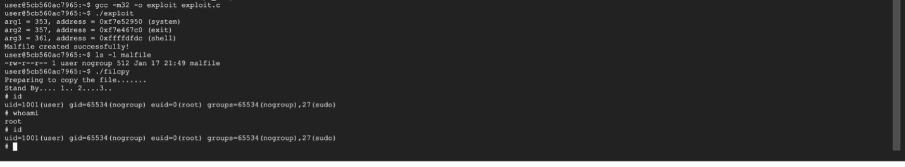

# Return-to-Libc (ret2libc) Buffer Overflow Attack

## Overview

This project demonstrates a **return-to-libc buffer overflow attack** on a vulnerable C program running in a 32-bit Linux environment. Rather than injecting shellcode onto the stack, ret2libc bypasses non-executable stack protections by redirecting program execution to existing library functions — specifically `system()` from libc — to spawn a root shell.

This was completed as part of my graduate coursework in cybersecurity at Northeastern University.

---

## BUFF_SIZE Calculation

Each student's buffer size is unique, derived from their NUID:

```
BUFF_SIZE = NUID % 456
```



---

## What Is a Buffer Overflow?

A buffer is a fixed-size block of memory allocated to hold data temporarily. When a program writes more data to a buffer than it was designed to hold, the excess data overwrites adjacent memory — this is a **buffer overflow**.

In the context of the runtime stack, this is especially dangerous. The stack stores critical control flow data like **return addresses** and **saved frame pointers**. If an attacker can overwrite a return address with a carefully chosen value, they can hijack the program's execution flow and redirect it wherever they want.

### Why This Matters

Buffer overflows remain one of the most historically significant vulnerability classes in software security. They've been at the root of countless real-world exploits, from the Morris Worm in 1988 to modern-day CVEs in embedded systems and IoT devices. Understanding how they work at a low level is foundational to both offensive security research and building effective defenses.

---

## What Is Return-to-Libc?

Traditional buffer overflow attacks inject malicious shellcode onto the stack and then redirect execution to it. Modern defenses like **NX (No-Execute) bits** and **DEP (Data Execution Prevention)** mark the stack as non-executable, which blocks this approach.

**Return-to-libc** sidesteps this entirely. Instead of executing code on the stack, the attack overwrites the return address to point to a function that already exists in the process's memory space — typically `system()` from the C standard library (libc). By carefully constructing a fake stack frame, the attacker passes `/bin/sh` as an argument to `system()`, which spawns a shell.

### The Key Insight

The attack works because shared libraries like libc are loaded into every process's address space. The attacker doesn't need to inject any code at all — they just need to arrange the stack so the program "returns" into `system("/bin/sh")` as if it were a normal function call.

---

## Attack Environment

| Component | Detail |
|---|---|
| **Architecture** | 32-bit (compiled with `-m32`) |
| **OS** | Linux (Docker container: `sierraneu/ret2libc`) |
| **Shell** | `/bin/zsh` (symlinked to `/bin/sh`) |
| **ASLR** | Disabled (`kernel.randomize_va_space=0`) |
| **Stack Protector** | Disabled (`-fno-stack-protector`) |
| **NX Bit** | Enabled (stack is non-executable) |

### Why These Conditions?

Disabling ASLR and stack canaries isolates the specific technique being studied. In a real-world scenario, additional bypass techniques (like information leaks or brute-forcing) would be needed to defeat ASLR, and format string vulnerabilities or other methods could be used to leak canary values. The NX bit is left **enabled** — that's the whole point of ret2libc: it works even when you can't execute code on the stack.

---

## Attack Methodology

### Step 1: Identify the Vulnerable Program

The target program `filcpy.c` reads data from a file (`malfile`) into a fixed-size buffer using a function with **no bounds checking**. The buffer size is unique per student, calculated from the NUID:

```
BUFF_SIZE = NUID % 456
```

This means the overflow offset varies, requiring each student to independently calculate their payload layout.



### Step 2: Disable Protections

```bash
# Disable ASLR
sudo sysctl -w kernel.randomize_va_space=0

# Symlink /bin/sh to zsh (zsh doesn't drop privileges like bash does)
sudo ln -sf /bin/zsh /bin/sh
```

The zsh symlink is critical. When a Set-UID program spawns a shell via `system()`, bash will drop elevated privileges. Zsh does not, which allows the spawned shell to retain root.

### Step 3: Compile with Protections Disabled

```bash
gcc -m32 -fno-stack-protector -z noexecstack -o filcpy filcpy.c
sudo chown root filcpy
sudo chmod 4755 filcpy
```

The binary is compiled as 32-bit with stack protector disabled. Ownership is set to root **before** enabling the Set-UID bit (`4755`), because changing ownership clears the SUID bit.

### Step 4: Find Critical Addresses

Three addresses are needed to construct the exploit payload:

**1. Address of `system()`** — where we redirect execution

**2. Address of `exit()`** — placed after `system()` as its "return address" for a clean exit

**3. Address of the `/bin/sh` string** — passed as the argument to `system()`

The first two are found using GDB:

```bash
touch malfile   # must exist before loading binary into gdb
gdb -q filcpy
(gdb) b main
(gdb) run
(gdb) p system
(gdb) p exit
```



For the `/bin/sh` string, I stored it as an environment variable and used a helper program (`getenv.c`) to locate its address in memory:

```bash
export MYSHELL="/bin/sh"
gcc -m32 -o getenv getenv.c
./getenv
```



> **Important:** The helper program's compiled name must be the same length as the vulnerable program's name. Environment variables are stored on the stack, and the filename length affects their position in memory. A name length mismatch would shift the address and break the exploit.

### Step 5: Construct the Exploit Payload

The exploit program (`exploit.c`) writes a crafted payload to `malfile`. The payload structure looks like this:

```
[ NOP padding to fill buffer + saved EBP ] [ system() addr ] [ exit() addr ] [ /bin/sh addr ]
```

Here's what's happening conceptually:

- **Buffer + EBP padding:** Fill the buffer and overwrite the saved frame pointer to reach the return address on the stack.
- **`system()` address (arg1):** Overwrites the return address. When the vulnerable function returns, execution jumps to `system()`.
- **`exit()` address (arg2):** Placed where `system()` expects its own return address. This ensures a clean exit instead of a segfault after the shell closes.
- **`/bin/sh` address (arg3):** Placed where `system()` expects its first argument. This is the command string that gets executed.

This layout reconstructs a valid stack frame that tricks `system()` into thinking it was called normally with `/bin/sh` as its argument.



### Step 6: Execute the Attack

```bash
./exploit     # generates the malicious malfile
ls -l malfile # verify it was created
./filcpy      # triggers the overflow, spawns root shell
```

Once the shell spawns:

```bash
# whoami
root
# id
uid=0(root) ...
```



---

## Stack Frame Visualization

```
        High Memory
    ┌──────────────────────┐
    │   /bin/sh address     │  ← arg to system()
    ├──────────────────────┤
    │   exit() address      │  ← return addr for system()
    ├──────────────────────┤
    │   system() address    │  ← overwrites original return addr
    ├──────────────────────┤
    │   AAAA (EBP overwrite)│  ← overwrites saved frame pointer
    ├──────────────────────┤
    │                       │
    │   NOP / padding       │  ← fills the buffer
    │                       │
    ├──────────────────────┤
        Low Memory
```

When `filcpy`'s vulnerable function hits its `ret` instruction, it pops `system()`'s address off the stack into EIP. The CPU begins executing `system()`, which sees `exit()` as its return address and `/bin/sh` as its argument — resulting in a root shell.

---

## Defenses and Real-World Context

This attack succeeds because multiple protections are disabled simultaneously. In a hardened environment, the following mitigations make this significantly more difficult:

| Defense | How It Helps |
|---|---|
| **ASLR** | Randomizes library addresses each run, so the attacker can't hardcode `system()`'s address |
| **Stack Canaries** | Places a random value before the return address; overflow corrupts it, triggering a crash before the return |
| **PIE (Position Independent Executables)** | Randomizes the base address of the binary itself |
| **RELRO (Relocation Read-Only)** | Prevents overwriting GOT entries used in more advanced exploitation |
| **CFI (Control Flow Integrity)** | Validates that indirect jumps and returns target expected locations |

Modern exploitation often chains multiple techniques — information leaks to defeat ASLR, ROP (Return-Oriented Programming) chains to bypass more restrictive environments, and heap-based attacks when the stack is well-protected.

---

## Tools Used

- **GDB** — debugging and address discovery
- **GCC** — compilation with specific flag configurations
- **Docker** — isolated lab environment
- **asciinema** — terminal session recording

---

## Key Takeaways

Working through this project reinforced several important concepts for me. First, understanding the stack layout at the assembly level is essential — the entire attack depends on knowing exactly where the return address sits relative to the buffer. Second, ret2libc demonstrates that marking the stack as non-executable is not sufficient on its own; defense-in-depth is necessary because attackers adapt to individual mitigations. Third, small details matter: the length of the compiled binary's filename, the order of ownership changes vs. SUID bit setting, and the choice of shell (`zsh` vs `bash`) all determine whether the attack succeeds or fails.

This project was a great hands-on exercise in thinking like an attacker — understanding not just *that* something is vulnerable, but *why* it's vulnerable and *how* the underlying system mechanics can be manipulated.

---

## References

- Aleph One, *Smashing the Stack for Fun and Profit* (Phrack Magazine, 1996)
- NIST NVD — Buffer Overflow CWE-120
- MITRE ATT&CK — T1203: Exploitation for Client Execution
